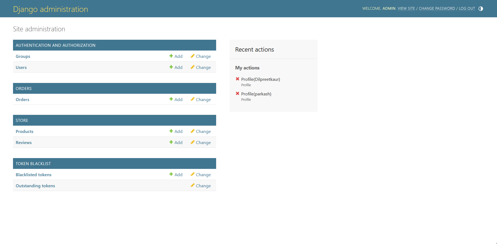
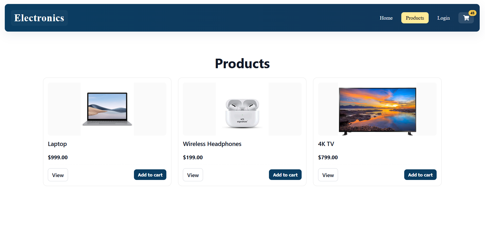
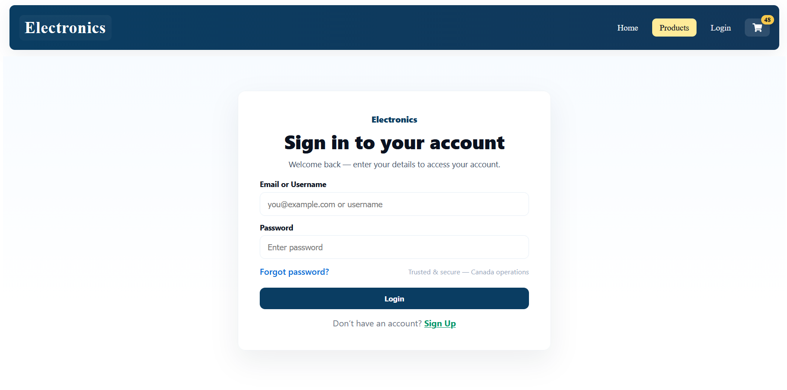
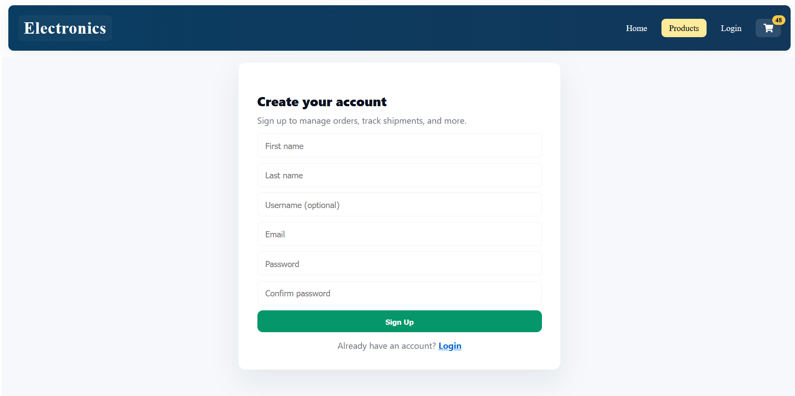
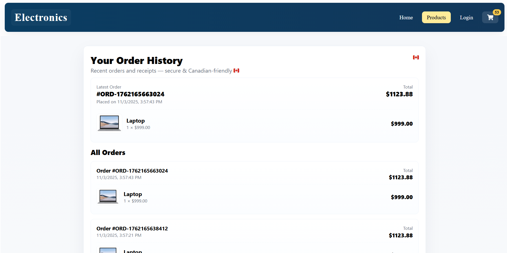

# 🛍️ Full Stack E-Commerce Website (React + Django REST API)

## 👩‍💻 Developer
**Dilpreet Kaur**  
Bachelor of Computer Applications (BCA), Punjab University  
Aspiring Full Stack Web Developer focused on scalable and modern web technologies.

---

## 🚀 Project Overview
This project is a **Full Stack E-Commerce Web Application** developed using **React (Vite)** for the frontend and **Django REST Framework** for the backend.  

It includes complete e-commerce functionalities such as product browsing, authentication, cart system, checkout, order history, and admin management.

---

## 🧩 Technologies Used
- **Frontend:** React (Vite), HTML5, CSS3, JavaScript (ES6+)
- **Backend:** Django, Django REST Framework (DRF)
- **Database:** SQLite
- **Version Control:** Git & GitHub
- **Deployment:** PythonAnywhere (backend), Loom (screen recording)
- **Hosting:** GitHub (frontend)

---

## 🖼️ Screenshots (Frontend)
| Home | Products | Login | Signup | Order History |
|------|-----------|--------|--------|----------------|
|  |  |  |  |  |

---

## 🔗 Live & Demo Links
- 🌍 **Backend Live (Password Protected):** [http://dilpreetkaur.pythonanywhere.com/admin/](http://dilpreetkaur.pythonanywhere.com/admin/)  
  > Note: The backend is **password-protected** (admin credentials required).  
  > For access, please contact the developer directly.

- 🎥 **Frontend Demo (Screen Recording):** [Watch on Loom](https://www.loom.com/share/b1c2790addb44efcaba0632635f41705)  
- 🎥 **Backend Demo (Screen Recording):** [Watch on Loom](https://www.loom.com/share/f34a4a464e0849848dbd446df41ee2d7)

---

## ⚙️ Features
✅ User Authentication (Signup, Login, Logout)  
✅ Product Browsing and Detail View  
✅ Cart Management  
✅ Checkout and Order History  
✅ Admin Dashboard (secured)  
✅ Responsive Design  

> The **backend code** (Django + REST API) and backend screenshots are available in the **master branch** of this repository.

---

## 🧠 Key Highlights
- Built an integrated frontend with REST APIs.  
- Implemented secure token authentication.  
- Backend deployed live on PythonAnywhere.  
- Added screenshots and screen recordings for professional presentation.  

---

## 👩‍💼 About the Developer
**Dilpreet Kaur**  
📍 Punjab, India  
💼 Aspiring Remote Full Stack Developer | Target Country: Canada  
📧 [dilpreet.kaur03032006@gmail.com](mailto:dilpreet.kaur03032006@gmail.com)  
🔗 [GitHub: DilpreetKaur-03](https://github.com/DilpreetKaur-03)

---

⭐ *This project demonstrates both frontend (React) and backend (Django REST API) integration with secure deployment, following industry-standard best practices.*

---

## 🗂️ Repository Structure
