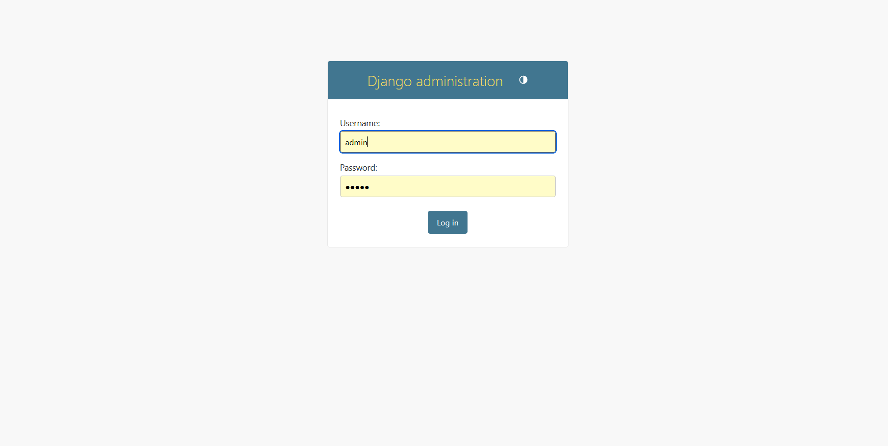
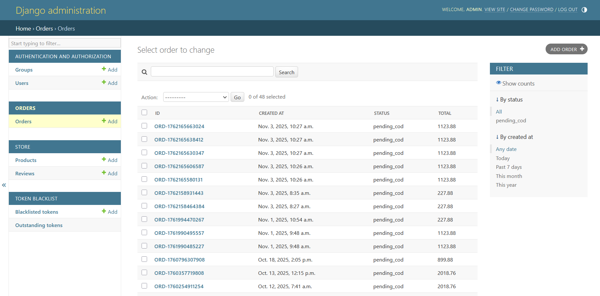
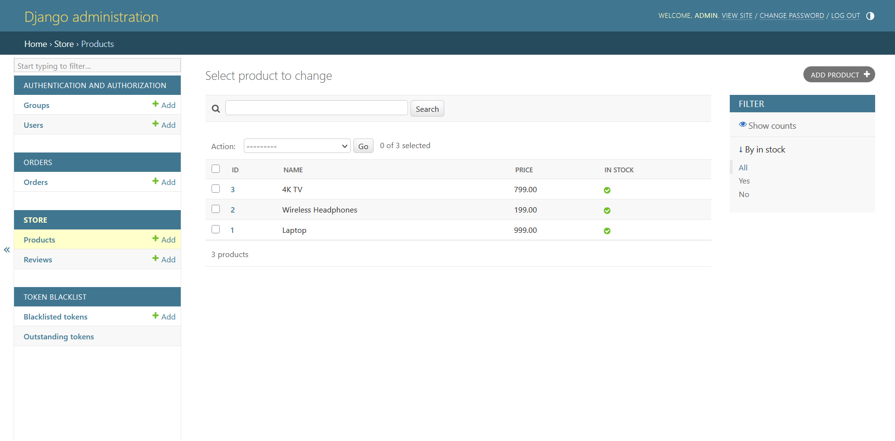
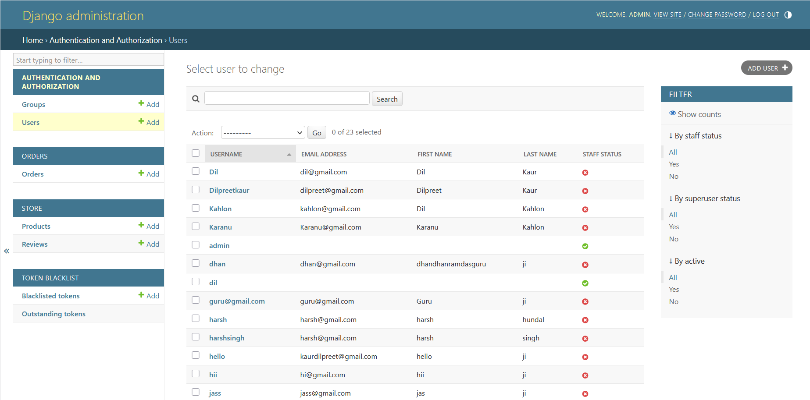

# ⚙️ E-Commerce Backend API (Django REST Framework)

## 👩‍💻 Developer
**Dilpreet Kaur**  
Bachelor of Computer Applications (BCA), Punjab University  
Passionate about REST API development, backend integration, and scalable design.

---

## 🚀 Project Overview
This is the **backend** of the Full Stack E-Commerce project built with **Django REST Framework (DRF)**.  
It handles API endpoints for users, products, orders, and authentication.  
The backend connects seamlessly with the React (Vite) frontend.

---

## 🧩 Technologies Used
- **Framework:** Django, Django REST Framework  
- **Database:** SQLite  
- **Authentication:** Token-Based Auth  
- **Hosting:** PythonAnywhere  
- **Frontend Integration:** React (Vite)  
- **Version Control:** Git & GitHub  

---

## 🖼️ Screenshots (Backend)
| Admin Panel | Orders | Products | Users |
|--------------|---------|----------|-------|
|  |  |  |  |

---

## 🔗 Live & Demo Links
- 🌍 **Backend Deployment (Password Protected):** [http://dilpreetkaur.pythonanywhere.com/admin/](http://dilpreetkaur.pythonanywhere.com/admin/)  
  > This link requires **username and password** for access.  
  > For credentials, please contact the developer directly at [dilpreet.kaur03032006@gmail.com](mailto:dilpreet.kaur03032006@gmail.com).

- 🎥 **Backend Screen Recording:** [Watch on Loom](https://www.loom.com/share/f34a4a464e0849848dbd446df41ee2d7)  
- 🎥 **Frontend Screen Recording:** [Watch on Loom](https://www.loom.com/share/b1c2790addb44efcaba0632635f41705)

---

## 🔐 API Endpoints Overview
| Endpoint | Description |
|-----------|--------------|
| `/api/products/` | Fetch all products |
| `/api/products/<id>/` | Get product detail |
| `/api/users/` | Register and manage users |
| `/api/orders/` | Create and manage orders |
| `/api/reviews/` | Add and fetch product reviews |

---

## 🗂️ Project Structure

---

## ⚙️ Features
✅ RESTful APIs for all major e-commerce operations  
✅ Authentication with tokens  
✅ Admin panel for data management  
✅ Seamless React frontend integration  
✅ Password-protected backend for security  

---

## 🧠 Key Learning Outcomes
- Designed REST APIs with Django REST Framework  
- Integrated React frontend with secure authentication  
- Deployed backend with live access control  
- Implemented database relationships and models  

---

## 👩‍💼 Author
**Dilpreet Kaur**  
📍 Punjab, India | Remote Developer (Target: Canada)  
📧 [dilpreet.kaur03032006@gmail.com](mailto:dilpreet.kaur03032006@gmail.com)  
🔗 [GitHub: DilpreetKaur-03](https://github.com/DilpreetKaur-03)
